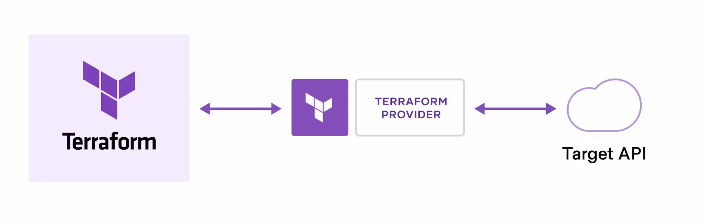

# Terraform specific instructions

Terraform is an Infrastructure as Code tool that allows us to build, change and version the cloud or on-prem infrastructure as a code.

Terraform is developed by Hashicorp and is an opensource tool as of now. Lately, there has been a tool called OpenTofu that works exactly like Terraform has been released and is being maintained by the Linux Foundation.





Terraform uses providers to interact with the API of the respective infrastructure provider like AWS, GCP, Azure or vCenter.


HashiCorp and the Terraform community have already written thousands of providers to manage many different types of resources and services. You can find all publicly available providers on the Terraform Registry (https://registry.terraform.io/), including Amazon Web Services (AWS), Azure, Google Cloud Platform (GCP), Kubernetes etc.

Working with Terraform has 3 stages

Write: We define the resources, which may be across multiple cloud providers and services.

Plan: Terraform creates an execution plan describing the infrastructure it will create, update, or destroy based on the existing infrastructure and your configuration.

Apply: On approval, Terraform performs the proposed operations in the correct order.

There are some good tutorials on Hashicorp Terraform in the link https://developer.hashicorp.com/terraform/tutorials

## Install Terraform on Ubuntu Server 22.04 LTS

Ensure that the pre-requisite packages to import the Hashicorp Key are available on the system.

```bash
$ sudo apt update
$ sudo apt install -y gnupg software-properties-common
```

Install Hashicorp GPG Key

```bash
$ wget -O- https://apt.releases.hashicorp.com/gpg | \
       gpg --dearmor | \
       sudo tee /usr/share/keyrings/hashicorp-archive-keyring.gpg > /dev/null
```

Verify the key's fingerprint

```bash
$ gpg --no-default-keyring \
      --keyring /usr/share/keyrings/hashicorp-archive-keyring.gpg \
      --fingerprint
```

Add the official Hashicorp repo to the system

```bash
echo "deb [signed-by=/usr/share/keyrings/hashicorp-archive-keyring.gpg] \
     https://apt.releases.hashicorp.com $(lsb_release -cs) main" | \
     sudo tee /etc/apt/sources.list.d/hashicorp.list
```

Update and install terraform

```bash
$ sudo apt update
$ sudo apt install terraform
```

For the training purpose, we can play around with Docker as the provider. Docker installation instructions are detailed in the docker folder of this repository. Feel free to make use of them.

Create a directory to store the terraform files. Terraform programs are usually saved with the extension of .tf for them to be easily identifyable. 

```bash
$ mkdir terraform-docker
$ cd terraform-docker
```

Create a file ```main.tf``` with below content.

```bash
terraform {
  required_providers {
    docker = {
      source  = "kreuzwerker/docker"
      version = "~> 3.0.1"
    }
  }
}
 
provider "docker" {}
 
resource "docker_image" "nginx" {
  name         = "nginx"
  keep_locally = false
}
 
resource "docker_container" "nginx" {
  image = docker_image.nginx.image_id
  name  = "DevOps"
 
  ports {
    internal = 80
    external = 8000
  }
}
```

Initialize the project, so that the provider can be downloaded.

```bash
$ terraform init
```

We can now apply the Terraform instructions on the docker infrastructure.

```bash
$ terraform apply
```

Once the instructions are applied, the nginx web page is going to be available on the http://192.168.56.13:8000 URL (192.168.56.13 is the IP address of the host on which docker and Terraform are installed)


We can destroy the created docker container and the downloaded image using either of the below commands.

```bash
$ terraform destroy
$ terraform apply -destroy
```

## Define variables with terraform run.

Create a new file ```variables.tf``` in the same directory with below content.

```bash
variable "container_name" {
  description = "Value of the name for the Docker container"
  type        = string
  default     = "TfNginx"
}
```

Update the ```main.tf``` file with below contents. Only change is, instead of 'DevOps' name, we are using a variable with ```var.container_name``` just as defined in the ```variables.tf``` file. Along with that, we'll also be updating the external port from 8000 to 8080.

```bash
resource "docker_container" "nginx" {
  image = docker_image.nginx.image_id
  name  = var.container_name
  ports {
    internal = 80
    external = 8080
  }
}
```

Applying the settings with new changes destroys the existing docker container and creates a new one with the name ```TfNginx``` using the variable defined and external port ```8080``` as mentioned in the resource declaration.

```bash
$ terraform apply
```

We can also apply the variable name on the fly while applying terraform plan.

```bash
$ terraform apply -var "container_name=TfNginxNew"
```

## Get the outputs from the terraform flow

Most of the times, it is obvious that we would need output of the terraform job. Create ```output.tf``` file.

```bash
output "container_id" {
  description = "ID of the Docker container"
  value       = docker_container.nginx.id
}
 
output "image_id" {
  description = "ID of the Docker image"
  value       = docker_image.nginx.id
}
```

The output declarations included in the ```output.tf``` gets tied to the workflow when ```terraform apply``` command is run. Once it is part of the flow, it can be retrieved using the ```terraform output``` command.

## Using terraform to deploy infrastructure on Vultr Cloud Platform

Below procedures allow terraform to provision infrastructure on Vultr cloud.


```bash
terraform {
    required_providers {
        vultr = {
            source = "vultr/vultr"
            version = "2.15.1"
        }
    }
}

provider "vultr" {
    api_key = var.VULTR_API_KEY
}

variable "VULTR_API_KEY" {}
```

```bash
VULTR_API_KEY = "your_vultr_api_key"
```

```bash
$ terraform init
```

```bash
resource "vultr_instance" "my_instance" {
    label = "sample-server"
    plan = "vc2-1c-1gb"
    region = "blr"
    os_id = "387"
    enable_ipv6 = true
}
```
Below is what the above module file defines:

vultr_instance: Sets the Vultr resource type to deploy, vultr_instance declares a server instance.

label: Specifies the instance label.

plan: Sets the desired instance specification. vc2-1c-1gb plan matches a Vultr instance with type vc2, 1 vCPU core, and 1 GB RAM.

region: Specifies your desired Vultr region to deploy the instance.

```bash
$ terraform plan
```

```bash
$ terraform apply
```

```bash
resource "vultr_kubernetes" "first_kubernetes_cluster" {
    region = "sgp"
    label     = "my-cluster"
    version = "v1.27.2+1"

    node_pools {
        node_quantity = 3
        plan = "vc2-2c-4gb"
        label = "my-app-nodes"
        auto_scaler = true
        min_nodes = 1
        max_nodes = 4
    }
}
```

vultr_kubernetes: Sets Vultr Kubernetes Engine (VKE) as the resource type.

region: Defines your target Vultr datacenter region.

label: Sets your Kubernetes Cluster label.

version: Specifies your target Kubernetes version.

node_pools: Defines the VKE node specifications

node_quantity: Sets the number of VKE nodes to add to your cluster

plan: Sets the node specifications plan. vc2-2c-4gb defines regular compute nodes with 2 vCPU cores and 4 GB RAM.

label: Defines the descriptive label of your VKE nodes.

auto-scaler: true enables auto-scaling on your VKE nodes.

min_nodes: Sets the minimum nodes in the pool.

max_nodes Sets the maximum number of nodes in the node pool.

```bash
$ terraform apply
```

```bash
$ terraform apply
```
